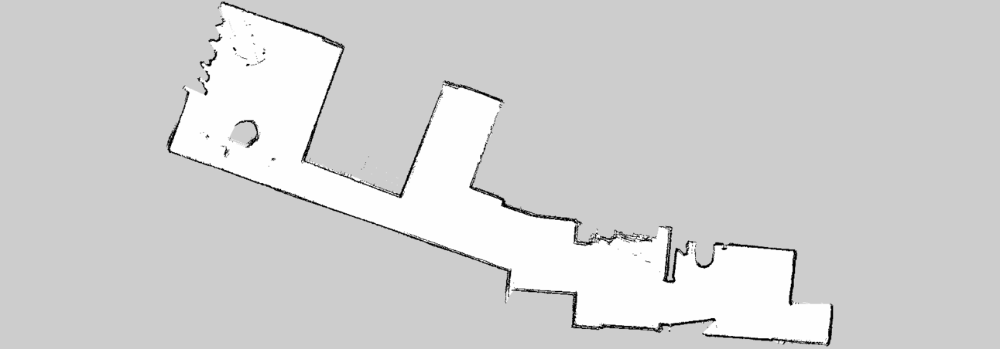
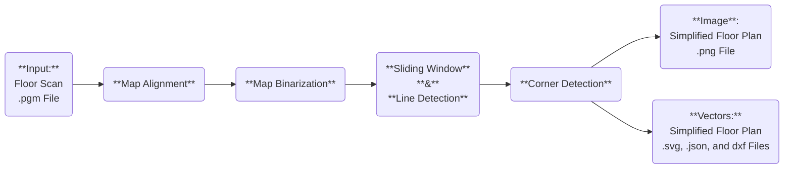

# Introduction
Repository with method to convert floor scans (in **.pgm** format) to a simplified representation. The simplified representation is generated in **.png, .svg, .json,** and **.dxf** formats. To do this conversion I used classical computer vision methods (not deep-learning-based).



# Description

The method is comprised of 5 stages:
1. **Map Alignment**: Check the orientation of the scanned floor plan and align it with the x and y axes of the frame
2. **Map Binarization**: Use the Canny method and the opening operation (morphological operation) to reduce noise in the plan and identify the region of interest (ROI).
3. **Sliding Window**: After the binarization of the map, its shape still irregular, by combining the sliding window method and a Hough Lines method, I attempt to filter out irregular edges and generate a simpler representation of the scanned floor by combining multiple small straigh lines in a map.
4. **Corner Detector**: Once with a simpler representation of the floor plan, I identify its corners using the Shi-Tomasi method, order them and filter any redundant corners or remaining noise points.
5. **Output Generation**: Once with the corners, I pass them as lines to JSON, SVG, and DXF files. Additionally, before generating the image of the simplified floor plan, I compute the exterior wall by estimating the corners' direction vectors and displacing these by a factor based on these vectors.

I invite you to look into [main.py](main.py) where you will find the overall pipeline divided into blocks and [outputs.py](utils/outputs.py) and [transforms.py](utils/transforms.py) to look at the used functions with detailed explanations of what they do.

# Requirements
This method was tested using **Python 3.13.2**, so please use an environment with that version of python. Additionally, the required packages can be found in the [requirements.txt](requirements.txt) and you can install them by running

For example you can create a [conda](https://docs.conda.io/projects/conda/en/latest/user-guide/install/index.html) environment:
```bash
conda create --name simple_plan python=3.13.2
```
Activate it:
```bash
conda activate simple_plan
```
And then install the required packages:
```bash
pip install -r requirements.txt
```

# How to use
To execute the pipeline you can simply run:
```bash
python main.py --img "<PATH/TO/PGM/FILE>"
```
If you wan to also get intermediate results you can run:
```bash
python main.py --img "<PATH/TO/PGM/FILE>" --verbose
```
